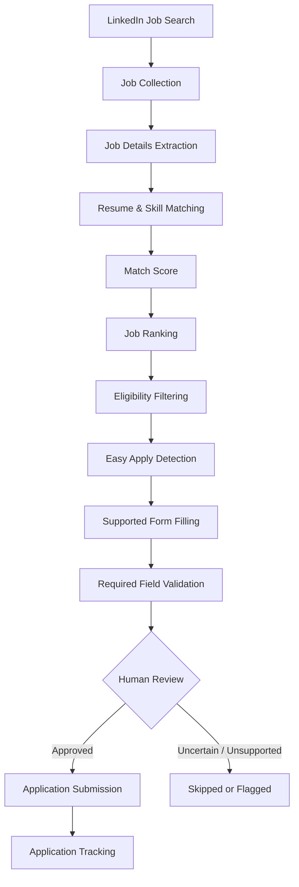

# AI Job Automation - Updated

This package contains the current project modules with the latest application-form
and daily-limit fixes.

## Updated behavior

- Minimum match score: 70%
- Daily confirmed application limit: 15
- Uses LinkedIn job ID for tracker identity
- Avoids re-offering APPLIED / SUBMITTED / INTERVIEW / REJECTED / WITHDRAWN jobs
- Handles LinkedIn navigation timeouts more gracefully
- Auto-submit follows `AUTO_SUBMIT`
- Application form knows the supplied contact, education, CTC, notice period,
  work-eligibility, relocation, internship, shift/weekend, disability/criminal-history,
  and technology-experience answers
- Unknown required questions remain a safety stop

## Replace

Copy these files into the project root:

- config.py
- application_tracker.py
- job_analyzer.py
- skill_matcher.py
- application_form.py
- easy_apply.py

Keep your existing `.env`, `resume/resume.pdf`, `data/`, and other project files.

## Test

PowerShell:

```powershell
.\venv\Scripts\python.exe -m py_compile config.py application_tracker.py job_analyzer.py skill_matcher.py application_form.py easy_apply.py
.\venv\Scripts\python.exe skill_matcher.py
.\venv\Scripts\python.exe job_analyzer.py
.\start_chrome.bat
.\venv\Scripts\python.exe easy_apply.py
```

Do not commit `.env`, LinkedIn credentials, or private resume files to GitHub.
# 🤖 AI Job Automation

<div align="center">

### AI-Assisted LinkedIn Job Search, Resume Matching & Easy Apply Automation

Discover jobs, score them against your resume, spot skill gaps, rank the best fits, and streamline supported LinkedIn Easy Apply applications, with you in control of every final decision.


</div>

---

## 📑 Table of Contents

- [Overview](#-overview)
- [Key Features](#-key-features)
- [How It Works](#-how-it-works)
- [Tech Stack](#-tech-stack)
- [Project Structure](#-project-structure)
- [Getting Started](#-getting-started)
- [Usage](#-usage)
- [How Matching Works](#-how-matching-works)
- [Output & Tracking](#-output--tracking)
- [Safety & Responsible Use](#-safety--responsible-use)
- [Troubleshooting](#-troubleshooting)
- [Roadmap](#-roadmap)
- [Contributing](#-contributing)
- [Author](#-author)
- [License](#-license)

---

## 📖 Overview

Applying for software jobs manually is repetitive: searching, opening dozens of tabs, reading job descriptions, comparing them to your resume, and filling near-identical forms again and again.

**AI Job Automation** is a Python-based personal job-search assistant that removes that repetition while keeping the applicant in charge of anything uncertain or high-stakes.

It can:

- Search LinkedIn with configurable keywords, locations, and filters
- Collect and store job listings and full descriptions
- Parse your resume (PDF) into structured data
- Calculate resume-to-job match scores
- Identify missing or required skills
- Rank opportunities by suitability
- Filter out ineligible roles
- Detect Easy Apply availability
- Fill supported application fields and validate required ones
- Pause for human review on anything it doesn't recognize
- Track every submitted application

> **Goal:** a personal job assistant that handles the repetitive parts of the search while you stay in control of the decisions that matter.

---

## ✨ Key Features

| Feature | Description |
|---|---|
| 🔍 **Automated Job Search** | Searches LinkedIn using configurable keywords, location, and filters |
| 📋 **Job Data Collection** | Collects title, company, location, and full description via Playwright + CDP |
| 📄 **Resume Parsing** | Extracts skills, experience, and projects from a PDF resume |
| 🧮 **Match Scoring** | Rule-based scoring of each job against your resume |
| 🕳️ **Skill Gap Detection** | Flags skills in the job description that are missing from your resume |
| 🏆 **Job Ranking** | Sorts opportunities by match score and eligibility |
| ✅ **Eligibility Filtering** | Removes jobs that don't meet your experience or location constraints |
| ⚡ **Easy Apply Detection** | Identifies listings that support LinkedIn Easy Apply |
| 📝 **Supported Form Filling** | Auto-fills recognized application fields |
| 🛡️ **Field Validation** | Checks required fields before allowing submission |
| 👀 **Human-in-the-loop Review** | Pauses on uncertain or unsupported fields for your input |
| 📊 **Application Tracking** | Logs every submission to CSV for follow-up |

---

## 🔄 How It Works



---

## 🧱 Tech Stack

| Area | Technology |
|---|---|
| Language | Python 3.10+ |
| Browser automation | Playwright + Chrome DevTools Protocol (CDP) |
| Resume parsing | PDF text extraction |
| Data storage | CSV-based pipelines |
| Matching engine | Rule-based resume/job comparison |

---

## 📂 Project Structure

```text
ai-job-automation/
├── scraper/        # LinkedIn search & job collection (Playwright/CDP)
├── extractor/      # Job description parsing
├── resume/         # Resume PDF parsing & data extraction
├── matcher/        # Match scoring & skill gap detection
├── ranker/         # Job ranking & eligibility filtering
├── apply/          # Easy Apply detection & form filling
├── tracker/        # Application tracking (CSV logs)
├── config/         # Search keywords, filters, personal settings (gitignored)
├── main.py         # Entry point
├── requirements.txt
└── README.md
```

> Keep personal files (your resume PDF, config, and application logs) out of version control. Add them to `.gitignore`.

---

## 🚀 Getting Started

### Prerequisites

- Python 3.10 or higher
- Google Chrome installed
- A LinkedIn account

### Installation

```bash
git clone https://github.com/gbhanuprasad5261/ai-job-automation.git
cd ai-job-automation

# (recommended) create a virtual environment
python -m venv .venv
source .venv/bin/activate        # Windows: .venv\Scripts\activate

pip install -r requirements.txt
playwright install chromium
```

### Configuration

1. Place your resume PDF in the location expected by the `resume/` module.
2. Set search keywords, location, and filters in `config/`.
3. Launch Chrome with remote debugging so the tool can reuse your logged-in session:

   ```bash
   # macOS
   /Applications/Google\ Chrome.app/Contents/MacOS/Google\ Chrome --remote-debugging-port=9222

   # Linux
   google-chrome --remote-debugging-port=9222

   # Windows
   "C:\Program Files\Google\Chrome\Application\chrome.exe" --remote-debugging-port=9222
   ```

4. Log in to LinkedIn manually in that Chrome window. **The tool never needs your password**; it attaches to your existing session.

---

## ▶️ Usage

```bash
python main.py
```

A typical run:

1. Searches LinkedIn using your configured keywords and filters
2. Collects listings and extracts full job descriptions
3. Scores and ranks jobs against your resume
4. Shows skill gaps for each shortlisted role
5. For Easy Apply jobs, fills supported fields and pauses for your review before submitting
6. Logs every submitted application to CSV

---

## 🧮 How Matching Works

Matching is currently **rule-based**, so results are transparent and easy to tune:

1. **Extract** skills, tools, and keywords from your resume
2. **Extract** required and preferred skills from each job description
3. **Compare** the two sets and weight required skills more heavily than optional ones
4. **Score** each job and list the missing skills as your skill gap
5. **Filter & rank** by score and your eligibility constraints (experience level, location, etc.)

Because it is keyword-driven, unusual phrasing in a job description can affect scores. Treat the score as a guide, not a verdict.

---

## 📊 Output & Tracking

Results are stored as CSV files so they are easy to open in Excel, Google Sheets, or pandas.

- **Collected jobs:** title, company, location, description, link
- **Ranked jobs:** match score, matched skills, missing skills, Easy Apply flag
- **Applications log:** what was submitted, when, and for which role

---

## 🔐 Safety & Responsible Use

- **Human in the loop:** the tool pauses on unknown, uncertain, or high-stakes fields instead of guessing.
- **No stored credentials:** it reuses your own logged-in browser session via CDP.
- **Personal use only:** this project is built for individual job seekers, not bulk or commercial scraping.
- **Keep private data private:** never commit your resume, config, or application logs.

### ⚠️ Disclaimer

Automating interactions with LinkedIn may conflict with LinkedIn's Terms of Service, and accounts that use automation can be restricted. Use this tool sparingly, review every application before it is submitted, and use it at your own risk. The author is not responsible for account restrictions or incorrect applications.

---

## 🛠️ Troubleshooting

| Problem | Likely fix |
|---|---|
| Can't connect to Chrome | Make sure Chrome was started with `--remote-debugging-port=9222` and no other Chrome instance is blocking the port |
| Not logged in to LinkedIn | Log in manually in the debug Chrome window, then re-run |
| Resume text looks empty | Use a text-based PDF; scanned image PDFs need OCR first |
| Form fields not filled | The field type may not be supported yet; complete it manually when the tool pauses |
| `playwright` errors | Re-run `playwright install chromium` |

---

## 🛣️ Roadmap

- [ ] LLM-based resume-to-job matching (beyond rule-based scoring)
- [ ] Support for additional job boards beyond LinkedIn
- [ ] Cover letter auto-drafting per job
- [ ] Web dashboard for reviewing ranked jobs and tracking applications
- [ ] Notification system for high-match new postings
- [ ] Automated tests and CI

---

## 🤝 Contributing

Suggestions and pull requests are welcome.

1. Fork the repository
2. Create a feature branch: `git checkout -b feature/your-feature`
3. Commit your changes: `git commit -m "Add your feature"`
4. Push and open a pull request

---

## 👤 Author

**G Bhanu Prasad**
📧 [gbhanuprasad1236@gmail.com](mailto:gbhanuprasad1236@gmail.com)
🔗 [LinkedIn](https://linkedin.com/in/g-bhanu-prasad-66ab1b225) · [GitHub](https://github.com/gbhanuprasad5261)

---

## 📄 License

This project is licensed under the MIT License.
